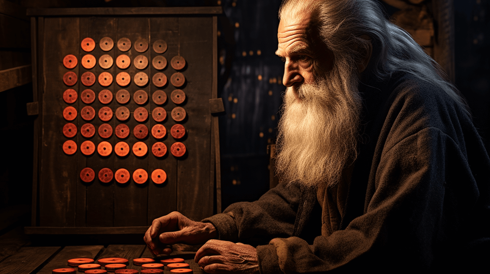

# Connect Four Game in C# - Coding Exercise



## Overview

This exercise is designed to assess your ability to write and understand C# code and .NET framework. The goal is to create a simple, text-based version of the "Connect Four" game. 

The game will take place in a console application, where the players will be asked to input the number of the column where they want to place their stones. The state of the game will be displayed using ASCII art characters. This will provide an opportunity to demonstrate your skills in using loops, arrays, user input, game logic, and writing unit tests.

## Requirements

### Level 1: Print the Game State

**Setting up the Game:** Create a 2D array of size 6x7 which represents the game board. Each cell in the array can either be empty or contain a player's stone. Initialize all cells as empty at the start of the game.

**Printing the Game Board:**
- Create a method to print the current state of the game board in the console. The game board should be printed using ASCII characters:
    - An empty cell should be represented by a `space` character.
    - A cell with player 1's stone should be represented by `X`.
    - A cell with player 2's stone should be represented by `O`.
    - The columns should be separated by a `|` character.
- This method should be called after each player's turn to show the updated state of the game board.
- An example of how the game board might look is:

    ```
    | | | | | | | |
    | | | | | | | |
    | | | | | | | |
    | | | |X| | | |
    | | |O|X| | | |
    | |O|X|O| | | |
    ```

### Level 2: Let Users Place Stones

**User Input:** After the game board is printed, prompt the current player to enter the column (0-6) where they want to place their stone. Ensure that the column is not already full. If the column is full or if the input is not valid, ask for input again until valid input is received.

### Level 3: Draw Detection

**Draw Detection:** After each move, if all cells on the game board are filled and there is no winner yet, declare the game as a draw and end the game.

### Level 4: Winner Detection

**Game Logic:** After each move, check if the current player has four of their stones connected in any direction (horizontal, vertical or diagonal). If they do, print a message declaring them as the winner and end the game.
    
**Loop:** The game should continue in a loop, alternating between players, until either a player has won or the game is a draw.

### Level 5: Add Unit Tests

**Unit Tests:** Write unit tests for your methods to ensure they are working as expected. The tests should cover basic functionality, edge cases, and error handling.
